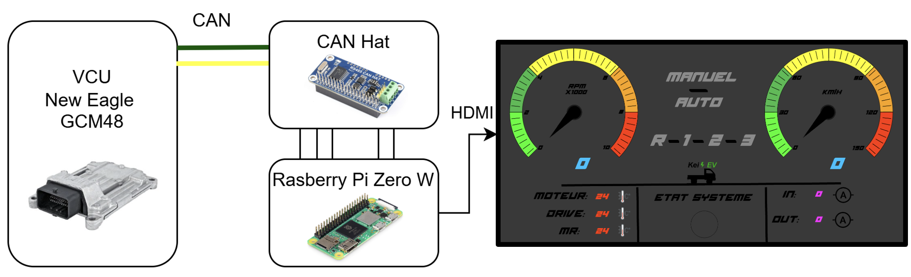

# EV Telemetry Dashboard


*Real-time EV telemetry dashboard displaying CAN data (RPM, speed, temperatures, current, and system state)*

Real-time dashboard for an electric pickup prototype, built with PyQt6.

This project enables visualization of **vehicle telemetry data transmitted over CAN bus**, including speed, RPM, temperatures, current, and system state, through a custom graphical interface.

---

## System Overview



The system operates as follows:

- The **Vehicle Control Unit (VCU)** processes real-time vehicle data  
- Data is transmitted over the **CAN bus**  
- A **Raspberry Pi 4B + CAN HAT** receives and decodes the CAN messages  
- The **PyQt6 dashboard** displays the data via HDMI in real time  

---

## Hardware-in-the-Loop CAN Validation


This test validates the complete CAN data pipeline prior to integration into the vehicle.

### Setup

- **Raspberry Pi 4B** – Data acquisition and CAN decoding  
- **Arduino** – CAN message generation (sensor emulation)  
- **CAN HAT** – Interface between Raspberry Pi and CAN network  
- **PC Dashboard** – Real-time GUI and animation display  

### Objective

Ensure that CAN messages are correctly transmitted, received, decoded, and visualized across the full system before deployment in the vehicle.

### Validation Scope

- **CAN communication integrity**  
  Verified that messages generated by the Arduino are correctly received and decoded by the Raspberry Pi  

- **End-to-end data pipeline**  
  Confirmed reliable data flow from hardware → Raspberry Pi → GUI  

- **GUI and animation response**  
  Ensured real-time CAN data correctly drives dashboard elements and animations  

- **Electrical wiring verification**  
  Validated correct wiring and stable system behavior prior to vehicle integration  

### Impact

This validation step reduces integration risk by:

- Detecting wiring and communication issues early  
- Ensuring correct CAN signal mapping  
- Verifying real-time responsiveness of the system  
- Preventing faults during full vehicle integration  

---

## Features

- Custom animated RPM and speed gauges  
- Real-time CAN-based telemetry visualization  
- Temperature and current monitoring  
- Gear and drive mode display  
- System status indicators  
- PyQt6-based graphical interface  
- Designed for embedded automotive display systems  

---

## Technologies Used

- Python  
- PyQt6  
- python-can  
- Qt Designer (.ui)  
- Raspberry Pi 4B (target platform)  
- CAN bus communication  

---

## How to Run

```bash
pip install -r requirements.txt
python main.py